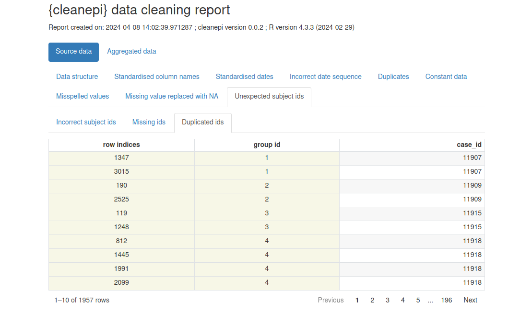

:::::::::::::::::::::::::::::::::::::: questions

- Comment nettoyer et standardiser les données épidémiologiques ?
::::::::::::::::::::::::::::::::::::::::::::::::

::::::::::::::::::::::::::::::::::::: objectives

- Expliquez comment nettoyer, organiser et standardiser les données épidémioloques en utilisant la librairie `{cleanepi}`
- Appliquer les opérations de nettoyage de données sur des données épidémiologiques simulées

::::::::::::::::::::::::::::::::::::::::::::::::

::::::::::::::::::::: prereq

Pour cet épisode, nous utiliserons les données simulées portant sur des individus atteints de la fièvre hémorargique ébola que vous devez:

- d'abord télécharger à partir d'[ici](https://epiverse-trace.github.io/tutorials-early/data/simulated_ebola_2.csv),
- puis l'enregistrez-le dans le répertoire `data/`.

:::::::::::::::::::::

## Introduction

Lors de l'analyse de données épidémiologiques, il est essentiel de s'assurer que les des données sont nettoyées, organisées, standardisées et validées pour garantir la précision (vous analysez ce que vous pensez analyser) et la reproductibilité (si quelqu'un veut revenir en arrière et répéter vos étapes d'analyse avec votre code, vous pouvez être sûr qu'il obtiendra les mêmes résultats) de l'analyse.
Cet épisode est consacré au nettoyage de données relatives aux épidémies à l'aide du package R [{cleanepi}](https://epiverse-trace.github.io/cleanepi/).
Pour illustrer l'utilisation des fonctionalités de ce package, nous les appliquerons sur des données simulées de cas d'Ebola.

En plus du package {cleanepi}, nous utiliserons d'autres fonctions qui proviennent des packages R suivants durant cette procédure de nettoyage des données :

* `{here}` pour faciliter le référencement des fichiers,
* `{rio}` pour importer les données dans R,
* `{dplyr}` pour effectuer certaines opérations de traitement de données,
* `{magrittr}` pour utiliser son **opérateur pipe (`%>%`)**.

<!-- Nous encourageons les utilisateurs disposant de versions récentes de R (version > 4.4.1) à utiliser l'opérateur de pipe de la librairie de base de R (`|>`) au lieu de `%>%`. -->

<!-- Nous vous recommandons également d'utiliser le package `{pak}` pour l'installation des packages dans R, comme indiqué ci-dessous. Vous pouvez consulter le [document de référence de`{pak}`](https://pak.r-lib.org/reference/features.html) pour plus de détails sur ses avantages. -->


``` r
# charger les librairies
library(tidyverse)
library(rio)
library(here)
library(cleanepi)
```

::::::::::::::::::: checklist

### L'opérateur double deux-points (`::`)

L'opérateur `::` de R permet d'accéder aux fonctions ou aux objets d'un package spécifique sans attacher l'intégralité du package (sans faire appel à la function`libray()`). Il offre plusieurs avantages, notamment :

* Indiquer explicitement le package d'origine d'une fonction, réduisant ainsi les ambiguïtés et les conflits potentiels lorsque plusieurs packages possèdent des fonctions portant le même nom.
* Permettre d'appeler une fonction depuis un package sans charger l'intégralité du package avec `library()`.

Par exemple, la commande `dplyr::filter(data, condition)` signifie que nous appelons la fonction `filter()` depuis la librairie `{dplyr}`.

:::::::::::::::::::

La première étape consiste à importer le jeu de données dans l'environnement de travail. Pour ce faire, nous suivrons les instructions décrites dans l'épisode [Importer les données de cas épidémiologiques](../episodes/read-cases.Rmd) pour
importer les données dans `R` et visualiser sa structure et son contenu.


``` r
# Importer les données
# supposons que le chemin d'accès au ficher est: data/simulated_ebola_2.csv
raw_ebola_data <- rio::import(
  here::here("data", "simulated_ebola_2.csv")
) %>%
  dplyr::as_tibble() # convertir en tibble
```


``` r
# Afficher les dix premières lignes du data frame
raw_ebola_data
```

``` output
# A tibble: 15,003 × 9
      V1 `case id` age     gender status `date onset` `date sample` lab   region
   <int>     <int> <chr>   <chr>  <chr>  <chr>        <chr>         <lgl> <chr> 
 1     1     14905 90      1      "conf… 03/15/2015   06/04/2015    NA    valdr…
 2     2     13043 twenty… 2      ""     Sep /11/13   03/01/2014    NA    valdr…
 3     3     14364 54      f       <NA>  09/02/2014   03/03/2015    NA    valdr…
 4     4     14675 ninety  <NA>   ""     10/19/2014   31/ 12 /14    NA    valdr…
 5     5     12648 74      F      ""     08/06/2014   10/10/2016    NA    valdr…
 6     5     12648 74      F      ""     08/06/2014   10/10/2016    NA    valdr…
 7     6     14274 sevent… female ""     Apr /05/15   01/23/2016    NA    valdr…
 8     7     14132 sixteen male   "conf… Dec /29/Y    05/10/2015    NA    valdr…
 9     8     14715 44      f      "conf… Apr /06/Y    04/24/2016    NA    valdr…
10     9     13435 26      1      ""     09/07/2014   20/ 09 /14    NA    valdr…
# ℹ 14,993 more rows
```

::::::::::::::::: discussion

Jettons un coup d'oeil sur ce jeu de données pour dressez la liste de toutes les anormalies qui pourraient poser problème durant l'analyse des données.

Certaines de ces anormalies vous sont-elles familières dans le cadre d'une analyse de données que vous avez déjà effectuée ?

::::::::::::::::::::::::::::

::::::::::::::::::: instructor

Animez une brève discussion pour établir un lien entre les anormalies détectées et les opérations de nettoyage requises.

Vous pouvez utiliser les termes suivants pour désigner les **anormalies qui ont été identifiées**:

- *Codification*: codification des valeurs dans certaines colonnes, telles que 'gender', 'age', à l'aide de chiffres, de lettres et de mots. Également l'existence de plusieur formats de dates (("jj/mm/aaaa", "aaaa/mm/jj", etc)) dans une même colonne telle que 'date_onset'. Moins visibles, les noms des colonnes.
- *Manquant*: comment interpréter une entrée telle que "" dans la colonne 'statut' ou "-99" dans d'autres circonstances ? Disposons-nous d'un dictionaire de données provenant du processus de collecte des données ?
- *Incohérences*: avoir des incohérences comme lorsque la date d'échantillonnage est antérieure à la date d'apparition des symptomes.
- *Valeurs non plausibles* Les valeurs non plausibles, comme les observations aberrantes avec des dates en dehors de la période concernée.
- *Les doublons* Toutes les observations sont-elles uniques ?

Vous pouvez utiliser ces termes pour vous référer aux **opérations de nettoyage**:

- Normaliser le nom des colonnes
- Normaliser les variables catégorielles comme 'gender'
- Normaliser les colonnes de type date
- Convertir des caractères en valeurs numériques
- Vérifier la séquence d'événements datés

::::::::::::::::::::::::::::::

## Une inspection rapide

Une exploration et une inspection rapides des données sont essentielles pour identifier les problèmes potentiels avant d'entamer le processus d'analyse des données.
Le package {cleanepi} simplifie ce processus grâce à la fonction `scan_data()`. Voyons comment vous pouvez l'utiliser.


``` r
cleanepi::scan_data(raw_ebola_data)
```

``` output
  Field_names missing numeric   date character logical
1         age  0.0646  0.8348 0.0000    0.1006       0
2      gender  0.1578  0.0472 0.0000    0.7950       0
3      status  0.0535  0.0000 0.0000    0.9465       0
4  date onset  0.0001  0.0000 0.9159    0.0840       0
5 date sample  0.0001  0.0000 0.9999    0.0000       0
6      region  0.0000  0.0000 0.0000    1.0000       0
```

Le résultat donne un aperçu du contenu de toutes les colonnes de type charactère, y compris la structure de ces noms de colonnes et le pourcentage de certains types de données qu'on y retrouve.
Vous pouvez constater que les noms des colonnes sont descriptifs mais manquent de cohérence. Certains sont composés de plusieurs mots séparés par des espaces. En outre, certaines colonnes contiennent plus d'un type de données, et il y a des valeurs manquantes dans d'autres.

## Opérations courantes

Cette section montre comment effectuer quelques opérations courantes de nettoyage de données à l'aide de la librairie `{cleanepi}`.

### Normalisation des noms de colonnes

Pour cet exemple de jeu de données, la normalisation des noms de colonnes consiste généralement à supprimer les espaces et à relier les mots avec `"_"`. Cette pratique permet de maintenir la cohérence et la lisibilité du jeu de données. Cependant, la fonction utilisée pour normaliser les noms de colonnes offre plus d'options. Entrez `?cleanepi::standardize_column_names` dans la console pour plus de détails.


``` r
sim_ebola_data <- cleanepi::standardize_column_names(raw_ebola_data)
names(sim_ebola_data)
```

``` output
[1] "v1"          "case_id"     "age"         "gender"      "status"     
[6] "date_onset"  "date_sample" "lab"         "region"     
```

Si vous souhaitez conserver certains noms de colonnes sans les soumettre au processus de normalisation, vous pouvez utiliser l'argument `keep` de la fonction `cleanepi::standardize_column_names()`. Cet argument accepte un vecteur de noms de colonnes qui doivent rester inchangés.

::::::::::::::::::::::::::::::::::::: challenge

- Quelles différences pouvez-vous observer dans les noms de colonnes ?

- Normalisez les noms des colonnes de l'ensemble de données d'entrée, mais conservez le nom de la première colonne tel quel.

::::::::::::::::: hint

Vous pouvez essayer `cleanepi::standardize_column_names(data = raw_ebola_data, keep = "V1")`

::::::::::::::::::::::

::::::::::::::::::::::::::::::::::::::::::::::::

### Suppression des irrégularités

Les données brutes contiennent souvent des irrégularités telles que des lignes **vides** et colonnes vides, ou des colonnes **constant** (où toutes les entrées ont la même valeur). Elles peuvent aussi contenir des doublons. Les fonctions de `{cleanepi}` comme `remove_duplicates()` et `remove_constants()` peuvent être utilisées pour supprimer ces irrégularités, comme le montre le morceau de code ci-dessous.


``` r
# Supprimer les données invariables
sim_ebola_data <- cleanepi::remove_constants(sim_ebola_data)
```

Maintenant, afficher le résultat pour identifier les colonnes constantes que vous avez supprimé.


``` r
# Supprimer les doublons
sim_ebola_data <- cleanepi::remove_duplicates(sim_ebola_data)
```

``` output
! Found 5 duplicated rows in the dataset.
ℹ Use `attr(dat, "report")[["duplicated_rows"]]` to access them, where "dat" is
  the object used to store the output from this operation.
```

::::::::::::::::::::: spoiler

#### Combien de lignes avez-vous supprimées ? Quelles lignes ont été supprimées ?

Vous pouvez obtenir le nombre et l'emplacement des lignes redondantes qui ont été identifiées à l'aide de la function `cleanepi::print_report()`.


``` r
# les doublons identifiés
doublons <- print_report(sim_ebola_data, "found_duplicates")
doublons
```

:::::::::::::::::::::

::::::::::::::::::::: challenge

Dans le jeu de données suivant :


``` output
# A tibble: 6 × 5
   col1  col2 col3  col4  col5  
  <dbl> <dbl> <chr> <chr> <date>
1     1     1 a     b     NA    
2     2     3 a     b     NA    
3    NA    NA a     <NA>  NA    
4    NA    NA a     <NA>  NA    
5    NA    NA a     <NA>  NA    
6    NA    NA <NA>  <NA>  NA    
```

Quelles sont les colonnes ou les lignes:

- contenant des doublons ?
- vides ?
- contenant des données constantes ?

::::::::::::::: hint

Les données constantes se réfèrent principalement aux lignes et colonnes vides, mais aussi aux colonnes invariables.

:::::::::::::::

:::::::::::::::::::::

::::::::::::::: instructor


``` r
cleaned_df <- df %>%
  cleanepi::remove_constants() %>%
  cleanepi::remove_duplicates()
```

``` output
! Constant data was removed after 2 iterations.
ℹ Enter `attr(dat, "report")[["constant_data"]]` for more information, where
  "dat" represents the object used to store the output from
  `remove_constants()`.
ℹ No duplicates were found.
```

```r
print_report(cleaned_df, "constant_data")
```


- indices des doublon : aucun
- colonnes vides :
  - premiere itération: col5
  - seconde itération: aucune
- lignes vides :
  - premiere itération: 6
  - seconde itération: 3, 4, 5
- colonnes constantes : col3, col4

Faites remarquer aux apprenants qu'ils peuvent obtenir des résultats différents en variant la valeur de l'argument `cutoff`.


``` r
cleaned_df <- df %>%
  cleanepi::remove_constants(cutoff = 0.5)
```

```r
print_report(cleaned_df, "constant_data")
```

:::::::::::::::

### Remplacer les valeurs manquantes

Outre les irrégularités, les données brutes peuvent contenir des valeurs manquantes, qui peuvent être representées par différentes chaînes de caractères (par ex. `"NA"`, `""`, `character(0)`). Pour garantir une analyse solide, il est conseillé de remplacer toutes les valeurs manquantes par `NA` dans l'ensemble du jeu de données. Vous trouverez ci-dessous un extrait de code démontrant comment vous pouvez remplacer les valeures manquantes, représentées par une chaîne vide `""`, en utilisant la librairie `{cleanepi}`:


``` r
sim_ebola_data <- cleanepi::replace_missing_values(
  data = sim_ebola_data,
  na_strings = ""
)

sim_ebola_data
```

``` output
# A tibble: 15,000 × 8
      v1 case_id age         gender status    date_onset date_sample row_id
   <int>   <int> <chr>       <chr>  <chr>     <chr>      <chr>        <int>
 1     1   14905 90          1      confirmed 03/15/2015 06/04/2015       1
 2     2   13043 twenty-five 2      <NA>      Sep /11/13 03/01/2014       2
 3     3   14364 54          f      <NA>      09/02/2014 03/03/2015       3
 4     4   14675 ninety      <NA>   <NA>      10/19/2014 31/ 12 /14       4
 5     5   12648 74          F      <NA>      08/06/2014 10/10/2016       5
 6     6   14274 seventy-six female <NA>      Apr /05/15 01/23/2016       7
 7     7   14132 sixteen     male   confirmed Dec /29/Y  05/10/2015       8
 8     8   14715 44          f      confirmed Apr /06/Y  04/24/2016       9
 9     9   13435 26          1      <NA>      09/07/2014 20/ 09 /14      10
10    10   14816 thirty      f      <NA>      06/29/2015 06/02/2015      11
# ℹ 14,990 more rows
```

<!-- idée : après avoir résolu le problème des chaînes na_string multiples, ajoutez un défi à ce sujet + ajoutez-les à l'ensemble des données brutes ! -->

### Validation des identifiants des individus

Chaque entrée du jeu de données représente un individu (par exemple, un patient ou un participant à une étude) et doit pouvoir être distinguée par un identifiant unique formatée d'une certaine façon. Ces identifiants peuvent contenir des nombres se situant dans un intervalle bien déterminé, a préfixe et/ou suffixe, être formatés de façon à contenir un nombre spécifique de caractères.
La librairie `{cleanepi}` propose la fonction `check_subject_ids()` permettant de vérifier si les identifiants des individus sont uniques et s'ils satisfont aux critères établis par l'utilisateur.


``` r
# vérifier si les identifiants des individus comportent des nombres
# variant entre 0 et 15000
sim_ebola_data <- cleanepi::check_subject_ids(
  data = sim_ebola_data,
  target_columns = "case_id",
  range = c(0, 15000)
)
```

``` output
! Found 1957 duplicated values in the subject Ids.
ℹ Enter `attr(dat, "report")[["duplicated_rows"]]` to access them, where "dat"
  is the object used to store the output from this operation.
ℹ No incorrect subject id was detected.
```

Notez que notre jeu de données simulé contient des doublons dans la colonne ayant les identifiants uniques des individus.

::::::::::::::::: spoiler

#### Comment corriger les identifiants des individus ?

Visualisons un rapport préliminaire avec `cleanepi::print_report(sim_ebola_data)`. Concentrez-vous sur l'onglet "Unexpected subject ids" pour identifier les identifiants qui nécessitent une correction.

Après avoir terminé ce tutoriel, nous vous invitons à explorer le guide de référence de la function [`cleanepi::check_subject_ids()`](https://epiverse-trace.github.io/cleanepi/reference/check_subject_ids.html) pour identifier la function qui peut remédier à cette situation.

:::::::::::::::::::::::::

### Normalisation des dates

Un jeu de données épidémiques contient généralement des colonnes de type date pour différents événements, tels que la date d'infection, la date d'apparition des symptômes, etc. Ces dates peuvent apparaître sous différents formats, et il est bon de les normaliser afin de bénéficier des puissantes fonctionalités de R conçues pour traiter les valeurs de type date durant l'analyse des données.
La librairies `{cleanepi}` fournit une fonctionnalité permettant de convertir les colonnes de type date dans les données épidémiologiques au format ISO8601,
garantissant la cohérence des différentes colonnes de type dates. Voici comment vous pouvez l'utiliser sur notre jeu de données simulé :


``` r
sim_ebola_data <- cleanepi::standardize_dates(
  sim_ebola_data,
  target_columns = c("date_onset", "date_sample")
)

sim_ebola_data
```

``` output
# A tibble: 15,000 × 8
      v1 case_id age         gender status    date_onset date_sample row_id
   <int> <chr>   <chr>       <chr>  <chr>     <date>     <date>       <int>
 1     1 14905   90          1      confirmed 2015-03-15 2015-06-04       1
 2     2 13043   twenty-five 2      <NA>      2013-09-11 2014-03-01       2
 3     3 14364   54          f      <NA>      2014-09-02 2015-03-03       3
 4     4 14675   ninety      <NA>   <NA>      2014-10-19 2031-12-14       4
 5     5 12648   74          F      <NA>      2014-08-06 2016-10-10       5
 6     6 14274   seventy-six female <NA>      2015-04-05 2016-01-23       7
 7     7 14132   sixteen     male   confirmed NA         2015-05-10       8
 8     8 14715   44          f      confirmed NA         2016-04-24       9
 9     9 13435   26          1      <NA>      2014-09-07 2020-09-14      10
10    10 14816   thirty      f      <NA>      2015-06-29 2015-06-02      11
# ℹ 14,990 more rows
```

Cette fonction convertit les valeurs dans les colonnes cibles au le format **YYYY-mm-dd**.

::::::::::::::::::: discussion

#### Comment cela est-il possible ?

Nous vous invitons à trouver la principale librairie qui rend cette normalisation possible au sein de `{cleanepi}` en lisant la section “Détails” du
[Manuel de référence sur la normalisation des variables de type date](https://epiverse-trace.github.io/cleanepi/reference/standardize_dates.html#details)!

:::::::::::::::::::

### Conversion en valeurs numériques

Dans les données brutes, certaines colonnes peuvent contenir un mélange de valeurs numériques et de caractères, et vous voudrez souvent convertir les caractères en numériques. Par exemple, certaines valeurs de la colonne de 'age' de notre jeu de données simulées sont écrites en mots. Dans `{cleanepi}` la fonction `convert_to_numeric()` permet d'effectuer la conversion de ces mots en chiffres, comme illustré ci-dessous.


``` r
sim_ebola_data <- cleanepi::convert_to_numeric(
  data = sim_ebola_data,
  target_columns = "age"
)

sim_ebola_data
```

``` output
# A tibble: 15,000 × 8
      v1 case_id   age gender status    date_onset date_sample row_id
   <int> <chr>   <dbl> <chr>  <chr>     <date>     <date>       <int>
 1     1 14905      90 1      confirmed 2015-03-15 2015-06-04       1
 2     2 13043      25 2      <NA>      2013-09-11 2014-03-01       2
 3     3 14364      54 f      <NA>      2014-09-02 2015-03-03       3
 4     4 14675      90 <NA>   <NA>      2014-10-19 2031-12-14       4
 5     5 12648      74 F      <NA>      2014-08-06 2016-10-10       5
 6     6 14274      76 female <NA>      2015-04-05 2016-01-23       7
 7     7 14132      16 male   confirmed NA         2015-05-10       8
 8     8 14715      44 f      confirmed NA         2016-04-24       9
 9     9 13435      26 1      <NA>      2014-09-07 2020-09-14      10
10    10 14816      30 f      <NA>      2015-06-29 2015-06-02      11
# ℹ 14,990 more rows
```

::::::::::::::::: callout

### Langues prise en charge

Il faut savoir que la fonction `cleanepi::convert_to_numeric()` fait appel à la fonction principale de la librairie `{numberize}`, qui permet de convertir, en valeurs entières positives, les mots écrits en anglais, français et espagnol.
:::::::::::::::::::::::::

## Autres opérations liées à l'épidémiologie

Outre les tâches courantes de nettoyage des données, telles que celles évoquées dans les sections précédentes, la librairie `{cleanepi}` offre des fonctionnalités supplémentaires spécialement conçues pour le traitement et l'analyse des données relatives aux épidémies. Cette section couvre certaines de ces tâches spécialisées.

### Vérification de la séquence des événements datés

Garantir l'ordre et la séquence correcte des événements datés est crucial dans l'analyse des données épidémiologiques, en particulier lors de l'analyse des maladies infectieuses, où la chronologie d'événements tels que la date d'apparition des symptômes et la date de collecte d'échantillons est essentielle. La librairie `{cleanepi}` fournit une fonction utile appelée `check_date_sequence()` précisément conçu dans ce but.

Voici un exemple de morceau de code démontrant l'utilisation de la fonction `check_date_sequence()` dans les 100 premières lignes de notre ensemble de données Ebola simulé.


``` r
cleanepi::check_date_sequence(
  data = sim_ebola_data[1:100, ],
  target_columns = c("date_onset", "date_sample")
)
```

``` output
! Detected 16 incorrect date sequences at lines: "10, 20, 22, 26, 29, 44, 46,
  54, 60, 63, 70, 71, 73, 80, 81, 90".
ℹ Enter `attr(dat, "report")[["incorrect_date_sequence"]]` to access them,
  where "dat" is the object used to store the output from this operation.
```

Cette fonctionnalité est essentielle pour garantir l'intégrité des données et la précision dans les analyses épidémiologiques, car elle permet d'identifier toute incohérence ou erreur dans l'ordre chronologique des événements, ce qui vous permet d'y remédier de manière appropriée.

### Substitution basée sur un dictionnaire

Dans le cadre du prétraitement des données, il est fréquent de rencontrer des scénarios dans lesquels certaines colonnes d'un jeu de données, comme la colonne "gender" dans notre jeu de données Ebola simulé, sont censées avoir des valeurs ou des facteurs spécifiques.
Cependant, il est également fréquent que des valeurs inattendues ou erronées apparaissent dans ces colonnes, et doivent être remplacées par des valeurs de valeurs appropriées. La librairie `{cleanepi}` offre une fonction qui prend en charge la substitution de valeurs basée sur un dictionnaire données. Ainsi, vous permet de remplacer des valeurs dans des colonnes spécifiques sur la base de correspondances définies dans un dictionnaire de données.

Par ailleurs, la librairie `{cleanepi}` fournit un exemple de dictionnaire intégré spécialement conçu pour les données épidémiologiques. Le code ci-dessous montre les correspondances qui y sont établies pour la colonne "gender".


``` r
test_dict <- base::readRDS(
  system.file("extdata", "test_dict.RDS", package = "cleanepi")
) %>%
  dplyr::as_tibble()

test_dict
```

``` output
# A tibble: 6 × 4
  options values grp    orders
  <chr>   <chr>  <chr>   <int>
1 1       male   gender      1
2 2       female gender      2
3 M       male   gender      3
4 F       female gender      4
5 m       male   gender      5
6 f       female gender      6
```

Nous pouvons maintenant utiliser ce dictionnaire pour substituer les valeurs de la colonne "gender" selon des catégories prédéfinies. Vous trouverez ci-dessous un exemple de code démontrant comment utiliser la fonction `clean_using_dictionary()` de la librairie {cleanepi} allant dans ce sens.


``` r
sim_ebola_data <- cleanepi::clean_using_dictionary(
  data = sim_ebola_data,
  dictionary = test_dict
)

sim_ebola_data
```

``` output
# A tibble: 15,000 × 8
      v1 case_id   age gender status    date_onset date_sample row_id
   <int> <chr>   <dbl> <chr>  <chr>     <date>     <date>       <int>
 1     1 14905      90 male   confirmed 2015-03-15 2015-06-04       1
 2     2 13043      25 female <NA>      2013-09-11 2014-03-01       2
 3     3 14364      54 female <NA>      2014-09-02 2015-03-03       3
 4     4 14675      90 <NA>   <NA>      2014-10-19 2031-12-14       4
 5     5 12648      74 female <NA>      2014-08-06 2016-10-10       5
 6     6 14274      76 female <NA>      2015-04-05 2016-01-23       7
 7     7 14132      16 male   confirmed NA         2015-05-10       8
 8     8 14715      44 female confirmed NA         2016-04-24       9
 9     9 13435      26 male   <NA>      2014-09-07 2020-09-14      10
10    10 14816      30 female <NA>      2015-06-29 2015-06-02      11
# ℹ 14,990 more rows
```

Cette approche simplifie le processus de nettoyage des données, en garantissant que les variables catégorielles dans les jeux de données épidémiologiques sont
catégorisées avec précision et prêtes pour une analyse plus ultérieures.

<!--
:::::::::::::::::::::::::: spoiler

#### Comment créer votre propre dictionnaire de données ?

Notez que, lorsqu'une colonne du jeu de données contient des valeurs qui ne figurent pas dans le dictionnaire, la fonction `cleanepi::clean_using_dictionary()` soulèvera une erreur.

Vous pouvez commencer à construire un dictionnaire de données personnalisé avec un jeu de données dans ou à l'extérieur de R, puis utiliser la fonction
`cleanepi::add_to_dictionary()` pour y ajouter de nouveaux éléments dans le dictionnaire. Ceci est illustré dans l'exemple ci-dessous:


``` r
new_dictionary <- tibble::tibble(
  options = "0",
  values = "female",
  grp = "sex",
  orders = 1L
) %>%
  cleanepi::add_to_dictionary(
    option = "1",
    value = "male",
    grp = "sex",
    order = NULL
  )

new_dictionary
```

``` output
# A tibble: 2 × 4
  options values grp   orders
  <chr>   <chr>  <chr>  <int>
1 0       female sex        1
2 1       male   sex        2
```

Vous pouvez avoir plus de détails dans la section "Dictionary-based data substituting" dans la
[Vignette](https://epiverse-trace.github.io/cleanepi/articles/cleanepi.html#dictionary-based-data-substituting) du package {cleanepi}.

Pour simplifier la correction des valeurs mals orthographiées, nous avons introduit la function `correct_misspelled_values()` à partir de la version `1.1.1` de la librairie {cleanepi}. Cette fonction permet d'établir des correspondances entre les valeurs mals orthographiées et l'ensemble des vraies valeurs que peuvent prendre les colonnes cibles. Ces valeurs mals
orthographiées seront ainsi substituées par les vraies valeurs qui leurs sont orthographiquement plus proches.


``` r
# remplacer automatiquement les valeurs mals orthographiées de la
# colonne 'status' avec les vraies
sim_ebola_data <- cleanepi::correct_misspelled_values(
  data = sim_ebola_data,
  target_columns = "status",
  wordlist = c("confirmed", "probable", "suspected", "died", "recovered"),
  confirm = FALSE # remplacement sans demander l'avis de l'utilisateur
)
```

``` error
Error: 'correct_misspelled_values' is not an exported object from 'namespace:cleanepi'
```

``` r
# remplacer les valeurs mals orthographiées de la colonne 'status' avec
# les vraies apres avoir demander la confirmation à l'utilisateur
sim_ebola_data <- cleanepi::correct_misspelled_values(
  data = sim_ebola_data,
  target_columns = "status",
  wordlist = c("confirmed", "probable", "suspected", "died", "recovered"),
  confirm = TRUE # remplacement après confirmation de l'utilisateur
)
```

``` error
Error: 'correct_misspelled_values' is not an exported object from 'namespace:cleanepi'
```

Notez qu'il faudrait préalablement convertir les colonnes cibles en `charactère`
avant de procéder à la substitution.

::::::::::::::::::::::::::
-->

### Calcul de l'intervalle de temps entre différentes dates

Durant l'analyse de données épidémiologiques, il est utile de suivre et d'analyser les événements se produisant au cours du temps, tels que la progression d'une épidémie (c'est-à-dire le temps écoulé entre la date de signalement du premier cas et aujourd'hui) ou la durée entre la durée entre la date de collection et d'analyse des échantillons (c'est-à-dire le temps écoulé entre la date de collecte des échantillons et aujourd'hui). 
L'exemple le plus courant est le calcul de l'âge des individus à partir de leur date de naissance (c'est-à-dire la différence de temps entre aujourd'hui et leurs dates de naissance).

La librairie `{cleanepi}` dispose d'une fonction permettant de calculer le temps écoulé entre deux événements datés à différentes échelles de temps. Par exemple, l'extrait de code ci-dessous utilise la fonction `cleanepi::timespan()` pour calculer le temps écoulé depuis la date à laquelle les échantillons ont été prélevées jusqu'au 3 janvier 2025 (`"2025-01-03"`).


``` r
sim_ebola_data <- cleanepi::timespan(
  data = sim_ebola_data,
  target_column = "date_sample",
  end_date = as.Date("2025-01-03"),
  span_unit = "years",
  span_column_name = "years_since_collection",
  span_remainder_unit = "months"
)

sim_ebola_data %>%
  dplyr::select(case_id, date_sample, years_since_collection, remainder_months)
```

``` output
# A tibble: 15,000 × 4
   case_id date_sample years_since_collection remainder_months
   <chr>   <date>                       <dbl>            <dbl>
 1 14905   2015-06-04                       9                7
 2 13043   2014-03-01                      10               10
 3 14364   2015-03-03                       9               10
 4 14675   2031-12-14                      -6              -11
 5 12648   2016-10-10                       8                2
 6 14274   2016-01-23                       8               11
 7 14132   2015-05-10                       9                7
 8 14715   2016-04-24                       8                8
 9 13435   2020-09-14                       4                3
10 14816   2015-06-02                       9                7
# ℹ 14,990 more rows
```

Après avoir exécuté la fonction `cleanepi::timespan()`, deux nouvelles colonnes nommées `years_since_collection` et `remainder_months` ont été ajoutées à la base de données **sim_ebola_data**. Ces colonnes contiennent respectivement le temps écoulé depuis la date de prélèvement de l'échantillon de chaque individu, mesuré en années, et le temps restant mesuré en mois.

::::::::::::::::::::::::::::::::::::::::::::::: challenge

Les données relatives à l'âge sont utiles dans beaucoup d'analyses qui seront menées après le nettoyage des données. Vous pouvez classer les âges en catégories pour générer des estimations stratifiées.

Utilisez le jeu de données `test_df.RDS` qui se trouve dans la librairie `{cleanepi}` pour calculez l'âge en années **jusqu'au 1er mars** à partir de la date de naissance des sujets, et le temps restant en mois. Nettoyez et standardisez les éléments nécessaires pour y parvenir.


``` r
# lire les donnees dans test_df.RDS
dat <- readRDS(
  file = system.file("extdata", "test_df.RDS", package = "cleanepi")
) %>%
  dplyr::as_tibble()
```

:::::::::::::::::::::::::::: indice

Avant de calculer l'âge, vous aurez besoin de:

- normaliser les noms des colonnes
- standardiser les colonnes de type date
- remplacer les valeurs manquantes par 'NA'

::::::::::::::::::::::::::::

:::::::::::::::::::::::::: solution

Dans la solution, nous avons ajouter `date_first_pcr_positive_test` parmi les colonnes de type date à standardiser étant donné que c'est une variable qui est souvent utilisée durant les analyse épidémiologiques.


``` r
dat_clean <- dat %>%
  # normaliser les noms de colonnes et les colonnes de type date
  cleanepi::standardize_column_names() %>%
  cleanepi::standardize_dates(
    target_columns = c("date_of_birth", "date_first_pcr_positive_test")
  ) %>%
  # replacer les chaînes de caractères représentant les données
  # manquantes avec NA
  cleanepi::replace_missing_values(
    target_columns = c("sex", "date_of_birth"),
    na_strings = "-99"
  ) %>%
  # calculer l'age en 'annees' and retourner le reste en 'mois'
  cleanepi::timespan(
    target_column = "date_of_birth",
    end_date = as.Date("2025-03-01"),
    span_unit = "years",
    span_column_name = "age_in_years",
    span_remainder_unit = "months"
  )
```

``` output
! Found <numeric> values that could also be of type <Date> in column:
  date_of_birth.
ℹ It is possible to convert them into <Date> using: `lubridate::as_date(x,
  origin = as.Date("1900-01-01"))`
• where "x" represents here the vector of values from these columns
  (`data$target_column`).
```

Maintenant, comment définiriez-vous les classes d'une variable numérique ?

::::::::::::::::::::::::::

:::::::::::::::::::::::::: solution

La solution la plus simple consiste à utiliser `Hmisc::cut2()`. Vous pouvez également utiliser `dplyr::case_when()`. Cependant cette solution nécessite plus de lignes de code et est plus appropriée pour les catégorisations personnalisées. Nous vous proposons ici une solution basée sur `base::cut()`:


``` r
dat_clean %>%
  # selectionner les colonnes d'intéret
  dplyr::select(
    study_id,
    sex,
    date_first_pcr_positive_test,
    date_of_birth,
    age_in_years
  ) %>%
  # categoriser la variable age [ajouter comme indice dans le challenge]
  # replacer avec la valeur maximale si elle est connue
  dplyr::mutate(
    age_category = base::cut(
      x = age_in_years,
      breaks = c(0, 20, 35, 60, Inf),
      include.lowest = TRUE,
      right = FALSE
    )
  )
```

``` output
# A tibble: 10 × 6
   study_id   sex date_first_pcr_posit…¹ date_of_birth age_in_years age_category
   <chr>    <int> <date>                 <date>               <dbl> <fct>       
 1 PS001P2      1 2020-12-01             1972-06-01              52 [35,60)     
 2 PS002P2      1 2021-01-01             1952-02-20              73 [60,Inf]    
 3 PS004P2…    NA 2021-02-11             1961-06-15              63 [60,Inf]    
 4 PS003P2      1 2021-02-01             1947-11-11              77 [60,Inf]    
 5 P0005P2      2 2021-02-16             2000-09-26              24 [20,35)     
 6 PS006P2      2 2021-05-02             NA                      NA <NA>        
 7 PB500P2      1 2021-02-19             1989-11-03              35 [35,60)     
 8 PS008P2      2 2021-09-20             1976-10-05              48 [35,60)     
 9 PS010P2      1 2021-02-26             1991-09-23              33 [20,35)     
10 PS011P2      2 2021-03-03             1991-02-08              34 [20,35)     
# ℹ abbreviated name: ¹​date_first_pcr_positive_test
```

Vous pouvez rechercher les valeurs maximales des variables à travers le résumé obtenu en utilisant la fonction `skimr::skim()`. Au lieu de `base::cut()` vous pouvez également utiliser `Hmisc::cut2(x = age_in_years,cuts = c(20,35,60))` qui calcule la valeur maximale et ne nécessite pas plus d'arguments.

::::::::::::::::::::::::::

:::::::::::::::::::::::::::::::::::::::::::::::

## Plusieurs opérations à la fois

L'exécution individuelle des opérations de nettoyage des données peut prendre beaucoup de temps et être source d'erreurs. La fonction `clean_data()` de la librairie `{cleanepi}` permet de simplifier ce processus en permettant d'exécuter plusieurs opérations à la fois.

Lorsque l'utilisateur ne spécifie aucune opération de nettoyage de données, la fonction applique automatiquement une série d'opérations de nettoyage de données. Voici un exemple de code illustrant l'utilisation de la fonction `clean_data()` sur le jeu de données simulé d'Ebola:


``` r
cleaned_data <- cleanepi::clean_data(raw_ebola_data)
```

``` output
ℹ Cleaning column names
```

``` output
ℹ Removing constant columns and empty rows
```

``` output
ℹ Removing duplicated rows
```

``` output
! Found 5 duplicated rows in the dataset.
ℹ Use `attr(dat, "report")[["duplicated_rows"]]` to access them, where "dat" is
  the object used to store the output from this operation.
```

En outre, vous pouvez combiner plusieurs opérations de nettoyage de données via l'opérateur pipe (`|>`) de la librairie de base de R ou celui de la librairie {magrittr} (`%>%`), comme illustré à travers le code ci-dessous.


``` r
# Exécuter les opérations de nettoyage de données en utilisant l'opérateur %>%
cleaned_data <- raw_ebola_data %>%
  cleanepi::standardize_column_names() %>%
  cleanepi::remove_constants() %>%
  cleanepi::remove_duplicates() %>%
  cleanepi::replace_missing_values(na_strings = "") %>%
  cleanepi::check_subject_ids(
    target_columns = "case_id",
    range = c(1, 15000)
  ) %>%
  cleanepi::standardize_dates(
    target_columns = c("date_onset", "date_sample")
  ) %>%
  cleanepi::convert_to_numeric(target_columns = "age") %>%
  cleanepi::check_date_sequence(
    target_columns = c("date_onset", "date_sample")
  ) %>%
  cleanepi::clean_using_dictionary(dictionary = test_dict) %>%
  cleanepi::timespan(
    target_column = "date_sample",
    end_date = as.Date("2025-01-03"),
    span_unit = "years",
    span_column_name = "years_since_collection",
    span_remainder_unit = "months"
  )
```


:::::::::::::: challenge

Avez-vous remarqué que `{cleanepi}` contient un ensemble de fonctions pour **diagnostiquer** l'état de propreté des données et un autre ensemble pour **effectuer** le nettoyage ?

Identifier les deux groupes :

- Sur une feuille de papier, écrivez le nom de chaque fonction dans la colonne correspondante :

| **Diagnostiquer** la propreté des données | **Effectuer** le nettoyage des données | 
| ------------------ | -------------------- |
| ...                | ...                  | 

::::::::::::::

:::::::::::::: instructor

Notez que `{cleanepi}` contient un ensemble de fonctions pour **diagnostiquer** l'état de propreté des données (par exemple `check_subject_ids()` et `check_date_sequence()` dans l'extrait de code ci-dessus) et un autre pour **effecture** les opérations de nettoyage (le reste des fonctions dans l'exemple ci-dessus).

::::::::::::::

## Rapport du nettoyage des données

`{cleanepi}` génère un rapport complet détaillant les résultats et les actions de tous les fonctions ayant servi au nettoyages de données.
Ce rapport se présente sous la forme d'un fichier HTML qui s'ouvrira automatiquement dans votre navigateur par défaut. Il comporte plusieurs sections. Chaque section correspond à une opération spécifique de nettoyage des données, et un clic sur chaque section vous permet d'accéder aux résultats de l'opération de nettoyage des données en question. Cette approche interactive permet aux utilisateurs d'examiner et d'analyser efficacement les effets des opérations de nettoyage des données.

Vous pouvez consulter le rapport de nettage de données à l'aide de la fonction `cleanepi::print_report(cleaned_data)`.

<p><figure>
     
    <figcaption>
            <p>Exemple de rapport de nettoyage de données généré par `{cleanepi}`</p> <p>Les rapports de nettoyage de données sont générés par `{cleanepi}`.
    </figcaption>
</figure>

::::::::::::::::::::::::::::::::::::: keypoints 

- Utiliser `{cleanepi}` pour nettoyer et normaliser les données à caractère épidémiologiques.
- Comprendre comment utiliser `{cleanepi}` pour effectuer des tâches courantes de nettoyage de données.
- Visualiser le rapport de nettoyage des données dans un navigateur, le consulter et prendre des décisions.

:::::::::::::::::::::::::::::::::::::


