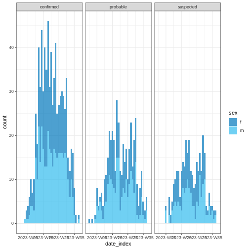
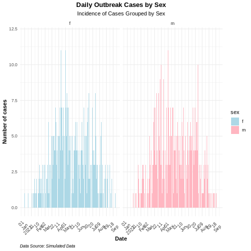

:::::::::::::::::::::::::::::::::::::: questions

- Comment agréger et résumer les données épidémiologiques ?
- Comment visualiser les données agrégées ?
- Quelle est la répartition des cas dans le temps, l'espace, en fonction du sexe, l'âge, etc ?

::::::::::::::::::::::::::::::::::::::::::::::::

::::::::::::::::::::::::::::::::::::: objectives

- Simuler des données synthétiques sur les épidémies
- Convertir un tableau de données des cas individuels (linelist) en tableau d'incidence des cas au cours du temps
- Créer des courbes épidémiques à partir de données d'incidence
::::::::::::::::::::::::::::::::::::::::::::::::

## Introduction

Dans un pipeline d'analyse de données, l'analyse exploratoire des données (AED) est une étape importante avant la modélisation mathématique. L'AED aide à de déterminer les relations entre les variables et de résumer leurs principales caractéristiques, souvent en visualisant les données.

Dans cet épisode, nous allons explorer les techniques d'analyse exploratoire des données épidémiologiques en utilisant des librairies de `R`.

L'un des aspects clés de l'analyse des données épidémiologiques est la notion de "*personne, lieu et temps*". Il est important d'identifier comment les événements observés - tels que les nombres de cas confirmés, d'hospitalisations, de décès et de guérisons - évoluent au cours du temps et comment ils varient en fonction des différents localités et facteurs démographiques, notamment le sexe, l'âge, etc.

Commençons par charger la librairie `{simulist}` pour simuler des données épidémiologiques à analyser. Nous utiliserons ensuite la librairie `{incidence2}` permettant d'agréger un tableau des données individuelles en fonction de caractéristiques spécifiques et de visualiser les courbes épidémiques (épicourbes) qui en résultent. Le tableau de données agrégées obtenu représente le nombre de nouveaux événements (c'est-à-dire l'incidence des cas au fil du temps). Pour le formatage des figures, nous utiliserons la librairie `{tracetheme}`. Nous utiliserons l'opérateur pipe (`%>%`) pour connecter certaines de leurs fonctions, y compris celles des packages `{dplyr}` et `{ggplot2}`, ferons donc faire appel à la librairie {tidyverse}.


``` r
# Charger les librairies
library(incidence2) # Pour aggréger et visualiser les données
library(simulist)
library(tracetheme)
library(tidyverse)
```

::::::::::::::::::: checklist

### L'opérateur double deux-points (`::`)

L'opérateur `::` de R permet d'accéder aux fonctions ou aux objets d'un package spécifique sans attacher l'intégralité du package (sans faire appel à la function`libray()`). Il offre plusieurs avantages, notamment :

* Indiquer explicitement le package d'origine d'une fonction, réduisant ainsi les ambiguïtés et les conflits potentiels lorsque plusieurs packages possèdent des fonctions portant le même nom.
* Permettre d'appeler une fonction depuis un package sans charger l'intégralité du package avec `library()`.

Par exemple, la commande `dplyr::filter(data, condition)` signifie que nous appelons la fonction `filter()` depuis la librairie `{dplyr}`.

:::::::::::::::::::

## Données synthétiques sur les épidémies

Pour illustrer le processus d'analyse exploratoire des données épidémiologiques, nous allons générer un tableau de données d'une épidémie hypothétique à l'aide de la librairie `{simulist}`. `{simulist}` génère des données simulées pour une épidémie selon la configuration définie.
Sa configuration par défaut permet de générer un tableau de données individuelles comme le montre le morceau de code ci-dessous.

Pour rappelle, vous pouvez désormais utiliser la librairie {readepi} pour importer vos données portant sur les cas individuels á partir des systèmes de gestion de base de données relationnelles, de DHIS2 et SORMAS.


``` r
# initialiser le générateur de nombres aléatoires pour la reproducibilité
set.seed(1)

# simuler un tableau de données
# pour une épidémie de la taille de 1000 à 1500 cas
sim_data <- simulist::sim_linelist(outbreak_size = c(1000, 1500)) %>%
  dplyr::as_tibble()
```

``` warning
Warning: Number of cases exceeds maximum outbreak size. 
Returning data early with 1546 cases and 3059 total contacts (including cases).
```

``` r
# Voir un aperçu des donnees simulees
sim_data
```

``` output
# A tibble: 1,546 × 13
      id case_name           case_type sex     age date_onset date_reporting
   <int> <chr>               <chr>     <chr> <int> <date>     <date>        
 1     1 Zahra al-Masri      probable  f        37 2023-01-01 2023-01-01    
 2     3 Waleeda al-Muhammad probable  f        12 2023-01-11 2023-01-11    
 3     6 Rhett Jackson       confirmed m        53 2023-01-18 2023-01-18    
 4     8 Sunnique Sims       confirmed f        36 2023-01-23 2023-01-23    
 5    11 Danielle Griggs     probable  f        77 2023-01-30 2023-01-30    
 6    14 Mohamed Parker      probable  m        37 2023-01-24 2023-01-24    
 7    15 Melissa Eriacho     probable  f        67 2023-01-31 2023-01-31    
 8    16 Maria Laughlin      probable  f        80 2023-01-30 2023-01-30    
 9    20 Phillip Park        confirmed m        70 2023-01-27 2023-01-27    
10    21 Dewarren Newton     probable  m        87 2023-02-09 2023-02-09    
# ℹ 1,536 more rows
# ℹ 6 more variables: date_admission <date>, outcome <chr>,
#   date_outcome <date>, date_first_contact <date>, date_last_contact <date>,
#   ct_value <dbl>
```

Ce tableau de données contient des enregistements simulés concernant des individus répertoriés lors d'une épidémie.

::::::::::::::::::: spoiler

## Ressources supplémentaires concernant les données relatives aux épidémies

Ce qui précède est la configuration par défaut de `{simulist}`. Elle suppose un certain nombre d'hypothèses sur la transmissibilité et la gravité de l'agent pathogène. Si vous souhaitez en savoir plus sur la fonction `simulist::sim_linelist()` et les autres fonctions de cette librairie,
consultez le [site avec la documentation](https://epiverse-trace.github.io/simulist/).

Vous pouvez également télécharger des jeux de données épidémiologiques réelles concernant des épidémies antérieures dans la librairie [`{outbreaks}`](https://www.reconverse.org/outbreaks/) de R.

:::::::::::::::::::

## Agrégation des données

Nous voudrons généralement analyser et visualiser le nombre de cas enregistrés en un jour ou une semaine, plutôt que de nous concentrer sur chaque cas individuel. Pour ce faire, il est nécessaire de regrouper le tableau des données individuelles en tableau de données d'incidence. La fonction `incidence2::incidence()` de la librairie [{incidence2}] (([https://www.reconverse.org/incidence2/articles/incidence2.html) permet de regrouper les données individuelles, généralement en fonction d'événements datés
et/ou d'autres caractéristiques.
Le morceau de code fourni ci-dessous montre la procédure de création d'un objet de la classe `incidence2` qui contiendra le nombre agrégé de cas à partir de la date d'apparition de leurs symptômes en utilisant le tableau de données d'Ebola simulé.


``` r
# creer un objet de classe incidence
# en agregeant le nombre de cas
# en fonction de la date d'apparition des symptomes
daily_incidence <- incidence2::incidence(
  sim_data,
  date_index = "date_onset",
  interval = "day" # Aggreger les données de façon journalière
)

# Voir un aperçu des données d'incidence
daily_incidence
```

``` output
# incidence:  232 x 3
# count vars: date_onset
   date_index count_variable count
   <date>     <chr>          <int>
 1 2023-01-01 date_onset         1
 2 2023-01-11 date_onset         1
 3 2023-01-18 date_onset         1
 4 2023-01-23 date_onset         1
 5 2023-01-24 date_onset         1
 6 2023-01-27 date_onset         2
 7 2023-01-29 date_onset         1
 8 2023-01-30 date_onset         2
 9 2023-01-31 date_onset         2
10 2023-02-01 date_onset         1
# ℹ 222 more rows
```

La librairie `{incidence2}` vous permet de varier l'intervalle de temps à utiliser lorsque vous agrégez vos données (par exemple, les données peuvent être agrégées de façon journalière, hebdomadaire, mensuelle, etc). Elle permet également de classer les cas selon un ou plusieurs facteurs. L'exemple ci-dessous est un extrait de code calculant le nombre hebdomadaire de cas  regroupés selon la date d'apparition des symptômes, le sexe et le type de cas.


``` r
# calculer l'incidence hebdomadaire
# des cas regroupés selon le sexe et le type de cas
weekly_incidence <- incidence2::incidence(
  sim_data,
  date_index = "date_onset",
  interval = "week", # obtenir le nombre hebdomadaire de cas
  groups = c("sex", "case_type") # regrouper par sexe et type de cas
)

# voir un aperçu de l'incidence hebdomadaire des cas
weekly_incidence
```

``` output
# incidence:  201 x 5
# count vars: date_onset
# groups:     sex, case_type
   date_index sex   case_type count_variable count
   <isowk>    <chr> <chr>     <chr>          <int>
 1 2022-W52   f     probable  date_onset         1
 2 2023-W02   f     probable  date_onset         1
 3 2023-W03   m     confirmed date_onset         1
 4 2023-W04   f     confirmed date_onset         2
 5 2023-W04   f     probable  date_onset         1
 6 2023-W04   m     confirmed date_onset         1
 7 2023-W04   m     probable  date_onset         1
 8 2023-W05   f     confirmed date_onset         3
 9 2023-W05   f     probable  date_onset         4
10 2023-W05   f     suspected date_onset         1
# ℹ 191 more rows
```

::::::::::::::::::::::::::::::::::::: callout

## Compléter les dates manquantes

Lorsque les cas sont regroupés en fonction de différents facteurs, il est possible que les événements impliquant ces groupes se produisent à des dates différentes dans l'objet de type `incidence2` qui en résulte. La fonction `incidence2::complete_dates()` permet de insérer les dates manquantes pour chaque groupe de l'objet de la classe incidence. Par défaut, le nombre de cas de ces groupes sera représenté par 0 pour cette date (où aucun membre de ces groupe n'avait été enregistré).
Cette fonctionnalité peut également être activées durant l'appel à la fonction `incidence2::incidence()` en donnant la valeur `TRUE` à l'argument `complete_dates`.


``` r
# creer un objet de la classe incidence
# contenant l'incidence journalière du
# nombre de cas, groupé par sexe
daily_incidence_2 <- incidence2::incidence(
  sim_data,
  date_index = "date_onset",
  groups = "sex",
  interval = "day", # Agreger par interval journalier
  complete_dates = TRUE # Compléter les dates manquantes
)

# voir un aperçu de l'incidence journaliere des cas
daily_incidence_2
```

``` output
# incidence:  534 x 4
# count vars: date_onset
# groups:     sex
   date_index sex   count_variable count
   <date>     <chr> <chr>          <int>
 1 2023-01-01 f     date_onset         1
 2 2023-01-01 m     date_onset         0
 3 2023-01-02 f     date_onset         0
 4 2023-01-02 m     date_onset         0
 5 2023-01-03 f     date_onset         0
 6 2023-01-03 m     date_onset         0
 7 2023-01-04 f     date_onset         0
 8 2023-01-04 m     date_onset         0
 9 2023-01-05 f     date_onset         0
10 2023-01-05 m     date_onset         0
# ℹ 524 more rows
```


::::::::::::::::::::::::::::::::::::::::::::::::

::::::::::::::::::::::::::::::::::::: challenge

## Défi 1 : Pouvez-vous le faire ?

- **Tâche** : calculer l'incidence **bihebdomadaire** des cas dans le tableau de donnèes `sim_data` en fonction de leur date d'admission et de leur revenu. Sauvegarder le résultat dans un objet appelé `biweekly_incidence`.

::::::::::::::::::::::::::::::::::::::::::::::::

## Visualisation

Les object de la classe `incidence2` peuvent être visualisés à l'aide de la fonction `plot()` de la librairie de base de R.
Le graphe qui en résulte est appelé courbe épidémique, ou épi-courbe. Le code ci-dessous génère des épi-courbes pour lee objets `daily_incidence` et `weekly_incidence` créés ci-dessus.


``` r
# visualiser l'incidence journaliere
base::plot(daily_incidence) +
  ggplot2::labs(
    x = "Time (in days)",
    y = "Dialy cases"
  ) +
  tracetheme::theme_trace() # appliquer le theme personnalise de epiverse
```


``` r
# visualiser l'incidence hebdomadaire
base::plot(weekly_incidence) +
  ggplot2::labs(
    x = "Time (in weeks)",
    y = "weekly cases" #
  ) +
  tracetheme::theme_trace()
```


:::::::::::::::::::::::: callout

#### Esthétique simple

Nous vous invitons à parcourir la [Vignette](https://www.reconverse.org/incidence2/articles/incidence2.html) de la librairie `{incidence2}`. Découvrez comment vous pouvez utiliser les arguments de la fonction `plot()` pour donner de l'esthétique lors de la visualisation de vos objets de la classe incidence2.


``` r
base::plot(weekly_incidence, fill = "sex")
```



Vous y trouverez entre autre argument: `show_cases = TRUE`, `angle = 45` et `n_breaks = 5`. Essayer de les utiliser pour voir comment ils changent l'apparence du graphe qui en découle.

::::::::::::::::::::::::

::::::::::::::::::::::::::::::::::::: challenge

## Défi 2 : Pouvez-vous le faire ?

- **Tâche** visualiser l'objet `biweekly_incidence`.

::::::::::::::::::::::::::::::::::::::::::::::::

## Courbe du nombre cumulé de cas 

Le nombre cumulé de cas peut être calculé à l'aide de la fonction `incidence2::cumulate()` à partir d'un objet de la classe `incidence2` et peut être visualisé de la même façon que dans les exemples précédents.


``` r
# calculer l'incidence cumulée
cum_df <- incidence2::cumulate(daily_incidence)

# visualiser l'incidence cumulée avec {ggplot2}
base::plot(cum_df) +
  ggplot2::labs(
    x = "Time (in days)",
    y = "weekly cases" #
  ) +
  tracetheme::theme_trace()
```


Notez que cette fonction préserve le regroupement, c'est-à-dire que si l'objet de la classe`incidence2` contient des groupes, elle accumulera les cas en conséquence.

::::::::::::::::::::::::::::::::::::: challenge

## Défi 3 : Pouvez-vous le faire ?

- **Tâche** visuliser le nombre cumulé de cas de l'objet `biweekly_incidence`.

::::::::::::::::::::::::::::::::::::::::::::::::

## Estimation la date du pic de l'épidémie

Vous pouvez estimer le pic - le moment où le nombre de cas enregistrés est le plus élevé - à l'aide de la fonction `incidence2::estimate_peak()` de la librairie {incidence2}.
Cette fonction utilise une méthode de bootstrap pour déterminer la période de pic du nombre de cas (c'est-à-dire en rééchantillonnant les dates avec remplacement, ce qui donne une distribution des périodes de pic estimés).


``` r
# estimer le pic de l'incidence journaliere
peak <- incidence2::estimate_peak(
  daily_incidence,
  n = 100,         # nombre de simulations à utiliser pour trouver le pic
  alpha = 0.05,    # niveau de significativite pour l'interval de confiance
  first_only = TRUE, # retourner la valeur du premier pic trouvé
  progress = FALSE  # Désactiver les messages de progression
)

# voir un aperçu du pic estime
print(peak)
```

``` output
# A tibble: 1 × 7
  count_variable observed_peak observed_count bootstrap_peaks lower_ci  
  <chr>          <date>                 <int> <list>          <date>    
1 date_onset     2023-05-01                22 <df [100 × 1]>  2023-03-26
# ℹ 2 more variables: median <date>, upper_ci <date>
```

Cet exemple montre comment estimer la date du pic de l'épidémie (date à laquelle le nombre de cas le plus élevé a été répertorié) à l'aide de la fonction `incidence2::estimate_peak()` avec un interval de confiance de $95%$ et en ré-échantillonnant 100 fois.

::::::::::::::::::::::::::::::::::::: challenge

## Défi 4 : Pouvez-vous le faire ?

- **Tâche** Estimation la période du pic de l'épidémie à partir de l'objet `biweekly_incidence`.

::::::::::::::::::::::::::::::::::::::::::::::::

## Visualisation avec ggplot2

`{incidence2}` permet d'obtenir des graphes basiques pour les épi-courbes, mais un travail supplémentaire est nécessaire pour créer des graphiques bien annotés. Cependant, en urilisant la librairie `{ggplot2}` vous pouvez générer des graphes plus sophistiqués et des épi-courbes avec plus de flexibilité dans leur annotation.
`{ggplot2}` est un package qui offre de nombreuses fonctionnalités. Cependant, nous nous focaliserons sur trois éléments clés pour la production d'épi-courbes : les histogrammes, la mise à l'échelle des axes des variables de type Date et de leurs étiquettes, et l'annotation générale du thème du graphe.
L'exemple ci-dessous montre comment configurer ces trois éléments pour un simple objet de la classe `{incidence2}`.


``` r
# definir comment les dates seront reparties sur l'axe des x
breaks <- seq.Date(
  from = min(as.Date(daily_incidence$date_index, na.rm = TRUE)),
  to = max(as.Date(daily_incidence$date_index, na.rm = TRUE)),
  by = 20 # chaque 20 jours
)

# creation de l'histogramme
ggplot2::ggplot(data = daily_incidence) +
  geom_histogram(
    mapping = aes(
      x = as.Date(date_index),
      y = count
    ),
    stat = "identity",
    color = "blue", # couleur de bordure de l'histogramme
    fill = "lightblue", # couleur de remplissage des bars de l'histogramme
    width = 1 # l'epaisseur des bars de l'histogramme
  ) +
  theme_minimal() + # utiliser un theme minimal
  theme(
    plot.title = element_text(face = "bold",
                              hjust = 0.5), # centrer le titre du gaphe en gras
    plot.subtitle = element_text(hjust = 0.5), # centrer le sous-titre
    plot.caption = element_text(face = "italic",
                                hjust = 0), # mettre la legende en italique
    axis.title = element_text(face = "bold"), # mettre les noms des axes en gras
    axis.text.x = element_text(angle = 45, vjust = 0.5) # tourner des 45 degrés
  ) +
  labs(
    x = "Date", # definir le nom de l'axe des x
    y = "Number of cases", # definir le nom de l'axe des y
    title = "Daily Outbreak Cases", # definir le titre du graphe
    subtitle = "Epidemiological Data for the Outbreak",
    caption = "Data Source: Simulated Data" # definir la legende du graphe
  ) +
  scale_x_date(
    breaks = breaks, # definir les limites personnalisee pour l'axe des x
    labels = scales::label_date_short() # Raccourcir les noms sur l'axe x
  )
```

``` warning
Warning in geom_histogram(mapping = aes(x = as.Date(date_index), y = count), :
Ignoring unknown parameters: `binwidth`, `bins`, and `pad`
```


Utilisez l'option `group` dans la fonction mapping pour visualiser une courbe épidémique avec différents groupes. Si plusieurs variables ont été utilisées pour regrouper les cas, utilisez l'option `facet_wrap()` comme le montre l'exemple ci-dessous :


``` r
# visualiser l'incidence journaliere avec des facettes liées au sexe
ggplot2::ggplot(data = daily_incidence_2) +
  geom_histogram(
    mapping = aes(
      x = as.Date(date_index),
      y = count,
      group = sex, # grouper les bars par sexe
      fill = sex
    ),
    stat = "identity"
  ) +
  theme_minimal() +
  theme(
    plot.title = element_text(face = "bold", hjust = 0.5),
    plot.subtitle = element_text(hjust = 0.5),
    plot.caption = element_text(face = "italic", hjust = 0),
    axis.title = element_text(face = "bold"),
    axis.text.x = element_text(angle = 45, vjust = 0.5)
  ) +
  labs(
    x = "Date",
    y = "Number of cases",
    title = "Daily Outbreak Cases by Sex",
    subtitle = "Incidence of Cases Grouped by Sex",
    caption = "Data Source: Simulated Data"
  ) +
  facet_wrap(~sex) + # creer un panel separant les groupes de la variable sexe
  scale_x_date(
    breaks = breaks,
    labels = scales::label_date_short()
  ) +
  scale_fill_manual(values = c("lightblue",
                               "lightpink")) # couleur personnalisees
```

``` warning
Warning in geom_histogram(mapping = aes(x = as.Date(date_index), y = count, :
Ignoring unknown parameters: `binwidth`, `bins`, and `pad`
```



::::::::::::::::::::::::::::::::::::: challenge

## Défi 5 : Pouvez-vous le faire ?

- **Tâche**: produire une figure annotée pour l'objet contenant les incidences bihebdomadiares `biweekly_incidence` à l'aide de la librairie `{ggplot2}`.

::::::::::::::::::::::::::::::::::::::::::::::::

::::::::::::::::::::::::::::::::::::: keypoints

- Utiliser `{simulist}` pour générer des données épidémiologiques synthétiques
- Utilisez `{incidence2}` pour agréger les données épidémiologiques en fonction d'événements datés et d'autres variables pour produire des épi-courbes.
- Utilisez `{ggplot2}` pour produire des courbes épidémiques mieux annotées.
::::::::::::::::::::::::::::::::::::::::::::::::


